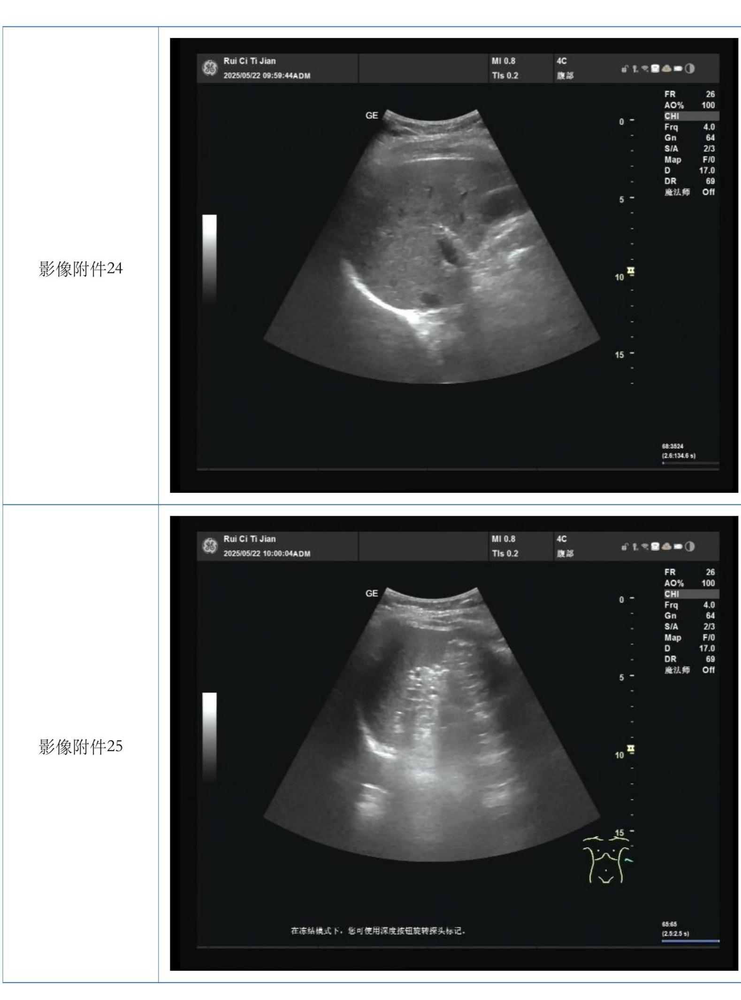
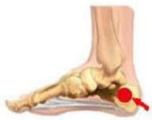

<table><tr><td colspan="2">体检编号：</td><td colspan="2"></td></tr><tr><td></td><td colspan="3">瑞慈健康体检体检报告书</td></tr><tr><td>姓名：</td><td></td><td></td><td rowspan="6"></td></tr><tr><td>性别：</td><td>女</td><td></td></tr><tr><td>检查日期：</td><td>2025-05-22</td><td></td></tr><tr><td>年龄：</td><td></td><td></td></tr><tr><td>身份证：</td><td></td><td></td></tr><tr><td>工作单位： 部门：</td><td colspan="3">广州--个人</td></tr><tr><td>工号：</td><td colspan="3"></td></tr><tr><td>职业：</td><td colspan="3"></td></tr></table>

健康问卷  

<table><tr><td>项目名称</td><td>检查结果</td></tr><tr><td>既往史(外)</td><td>无特殊</td></tr><tr><td>手术史名称</td><td>无特殊</td></tr><tr><td>外伤史部位</td><td>无特殊</td></tr><tr><td>过敏</td><td>无特殊</td></tr><tr><td></td><td>检查医师：韩丽菊</td></tr></table>

一般检查  

<table><tr><td>项目名称</td><td>检查结果</td></tr><tr><td>身高</td><td>158.0cm</td></tr><tr><td>体重</td><td>56.2kg</td></tr><tr><td>体重指数BMI</td><td>22.5</td></tr><tr><td>收缩压</td><td>108mmHg</td></tr><tr><td>舒张压</td><td>68 mmHg</td></tr><tr><td>腰围</td><td>84.0cm</td></tr><tr><td></td><td>88.0 m</td></tr><tr><td>腰臀比</td><td></td></tr><tr><td>0.95</td><td>检查者：代林彦</td></tr></table>

内科  

<table><tr><td>项目名称</td><td>检查结果</td></tr><tr><td>营养</td><td>营养良好</td></tr><tr><td>面容</td><td>正常</td></tr><tr><td>胸廓</td><td>正常</td></tr></table>

<table><tr><td>嗜酸性粒细胞百分</td><td>2.60</td><td>0.5-5</td><td>%</td><td></td></tr><tr><td>嗜碱性粒细胞百分比</td><td>0.50</td><td>0-1</td><td>%</td><td></td></tr><tr><td>中性粒细胞数</td><td>3.38</td><td>2-7</td><td>*10^9/L</td><td></td></tr><tr><td>淋巴细胞数</td><td>1.50</td><td>0.8-4</td><td>*10^9/L</td><td></td></tr><tr><td>单核细胞数</td><td>0.24</td><td>0.12-0.8</td><td>*10^9/L</td><td></td></tr><tr><td>嗜酸性粒细胞数</td><td>0.14</td><td>0.05-0.5</td><td>*10^9/L</td><td></td></tr><tr><td>嗜碱性粒细胞数</td><td>0.03</td><td>0-0.1</td><td>*10^9/L</td><td></td></tr><tr><td>红细胞</td><td>3.65</td><td>3.8-5.1</td><td>*10^12/L</td><td>↓</td></tr><tr><td>血红蛋白</td><td>116</td><td>115-150</td><td>g/L</td><td></td></tr><tr><td>红细胞压积</td><td>35.90</td><td>33-45</td><td>%</td><td></td></tr><tr><td>平均红细胞体积</td><td>98.4</td><td>82-100</td><td></td><td></td></tr><tr><td>平均血红蛋白量</td><td>31.78</td><td>27-34</td><td></td><td></td></tr><tr><td>平均血红蛋白浓度</td><td>324.00</td><td>316-354</td><td>g/L</td><td></td></tr><tr><td>红细胞分布宽度-SD</td><td>42.9</td><td>21-52</td><td></td><td></td></tr><tr><td>血小板</td><td>269.00</td><td>125-350</td><td>*10^9/L</td><td></td></tr><tr><td>血小板平均体积</td><td>7.9</td><td>6.5-12.00</td><td></td><td></td></tr><tr><td>血小板分布宽度</td><td>15.9</td><td>9-17</td><td>%</td><td></td></tr><tr><td>血小板压积</td><td>0.21</td><td>0-2.9</td><td>%</td><td></td></tr></table>

审核者：傅晓珍 检查者：招晓婷   
检验时间：2025-05-2310:54:59

检验项目：血清-CST4  

<table><tr><td>项目名称</td><td>结果</td><td>参考值</td><td>单位</td><td>标志</td></tr><tr><td>人半胱氨酸蛋自酶抑制剂</td><td>47.97</td><td>0~101</td><td>U/m1</td><td></td></tr></table>

审核者：张莉 检查者：彭佳妮   
检验时间：2025-05-2420:06:24

检验项目：阴道分泌物检验   

<table><tr><td>项目名称</td><td>结果</td><td>参考值</td><td>单位</td><td>标志</td></tr><tr><td>滴虫</td><td>一</td><td></td><td></td><td></td></tr><tr><td>霉菌</td><td></td><td></td><td></td><td></td></tr><tr><td>清洁度</td><td>Ⅱ°</td><td></td><td></td><td></td></tr></table>

审核者：薛毓峰 检查者：王捷  
检验时间：2025-05-2211:22:00

呼气试验   

<table><tr><td>项目名称</td><td>检查结果</td></tr><tr><td>C13呼试验(HP)</td><td>呼试验阴性</td></tr></table>

# 广州瑞慈瑞穗健康体检中心13C呼气试验Hp检验报告

<table><tr><td rowspan="15">影像报告</td><td></td><td colspan="2">个人信息</td></tr><tr><td>姓名：</td><td>性别：女</td><td>年龄</td></tr><tr><td>体检号：</td><td>检验日期：2025-05-22</td><td>机器型号：HY-IREXBplus</td></tr><tr><td>试剂名称：13c尿素</td><td>纯度：99%</td><td>电话：</td></tr><tr><td>地址</td><td></td><td></td></tr><tr><td></td><td colspan="2">检验结果</td></tr><tr><td>指标：DOB值</td><td colspan="2">检测值：0.17 结果：阴性(-)</td></tr><tr><td></td><td>检验标准</td><td></td></tr><tr><td></td><td colspan="2">DOB≥4.0为阳性</td></tr><tr><td colspan="6">DOB&lt;4.0为阴性</td></tr><tr><td colspan="6">图形分析</td></tr><tr><td rowspan="3"></td><td></td><td></td><td></td><td></td><td></td></tr><tr><td>2.5 10</td><td></td><td></td><td></td><td></td></tr><tr><td>0 5</td><td>10</td><td></td><td>15</td><td>20 25 30</td></tr><tr><td rowspan="5"></td><td colspan="5">-Standard -Result</td></tr><tr><td colspan="6">结果评价 13C呼气试验HD检验报告结果：阴性.</td></tr><tr><td colspan="6"></td></tr><tr><td colspan="6">检验人员： 审核人： 本报告只对本次检验负责</td></tr></table>

超声条件及图像质量【乙】肝脏形态大小正常，实质回声分布均匀，血管纹理清晰。门静脉内径正常。CDFI：血流信号未见明显异常。胆囊形态正常，壁欠光滑，可见多个稍回声光团附于内壁，其约5×4mm，无声影，无移动，肝内外胆管未见明显扩张。CDFI：血流信号未见明显异常。脾脏形态正常，包膜完整，内部回声均匀。CDFI：流信号未见明显异常。双肾形态正常范围，包膜光滑，集合系统未见明显分离。CDFI：流信号未见明显异常。  
检查描述 块尚正常：实质见明未见明显增厚，双侧附件区未双侧乳腺腺体厚度正常，结构清晰，分布不均匀，腺管未见明显扩张，于右侧乳腺12点距乳晕处，可见一个低回声结节，大小约10×7mm，边界尚清晰。CDFI血流信号未见明显异常。左侧乳腺未见明显占位性病变。甲状腺形态大小正常，包膜完整，实质回声不均匀，双侧叶均见多个结节右侧其一大小约7×4mm（为囊实性）左侧其一大小约7x4mm（为囊实性，边界尚清，形态规则，内部回声欠均匀。峡部未见明显异常回声。CDFI：上述结节内未见明显异常血流信号。双侧颈总动脉内径正常，内膜不光滑，内中膜增厚，左、右侧厚分别约1.0mm、1.0mm。左侧颈动脉分叉处后壁可见一个大小约2.1x5.1mm的低回声斑块附着于管壁。CDF：斑块处可见充盈缺损。胆囊多发息肉样病变绝经期子宫右侧乳腺结节（BI-RADS4a类），建议进一步检查  
检查结论 LRADS3左侧颈动脉斑块形成肝、脾、双肾未见明显异常左侧乳腺未见明显占位性病变12=0FR 34A0% 100GE 0 CHIFrq 10.0Gn 62SIA 3/3MapDDR魔法师 off  
影像附件147:47(1.41.43))

  
影像附件7

  
影像附件9

  
影像附件10

  
影像附件11

  
影像附件13

<table><tr><td>心率</td><td>60次/分</td></tr><tr><td>心</td><td>齐</td></tr><tr><td>心音</td><td>正常</td></tr><tr><td>心脏杂音</td><td>无</td></tr><tr><td>肺部</td><td>两肺呼吸音正常</td></tr><tr><td>腹部</td><td>未见异常</td></tr><tr><td>肝脏</td><td>肋下未及</td></tr><tr><td>脾脏</td><td>肋下未及</td></tr><tr><td>下肢浮肿</td><td>无</td></tr><tr><td>神经反射</td><td>膝反射正常</td></tr><tr><td>外周血管</td><td>足背动脉搏动存在</td></tr><tr><td colspan="2"></td></tr></table>

外科  

<table><tr><td>项目名称</td><td>检查结果</td></tr><tr><td>皮肤</td><td>未见异常</td></tr><tr><td>浅表淋巴结</td><td>未见异常</td></tr><tr><td>甲状腺</td><td>双叶甲状腺结节</td></tr><tr><td>乳房</td><td>右乳腺结节</td></tr><tr><td>脊柱</td><td>未见异常</td></tr><tr><td>四肢关节</td><td>未见异常</td></tr><tr><td>肛门指诊</td><td>内痔</td></tr><tr><td>科室小结</td><td>双叶甲状腺结节 结</td></tr><tr><td colspan="2"></td></tr></table>

妇科  

<table><tr><td>项目名称</td><td>检查结果</td></tr><tr><td>外阴</td><td>未见异常</td></tr><tr><td>阴道</td><td>未见异常</td></tr><tr><td>宫颈</td><td>未见异常</td></tr><tr><td>宫体</td><td>未见异常</td></tr><tr><td>附件</td><td>未触及异常</td></tr><tr><td colspan="2"></td></tr></table>

眼科  

<table><tr><td>项目名称</td><td>检查结果</td></tr><tr><td>裸眼视力右</td><td>0.25</td></tr><tr><td>裸眼视力左</td><td>0.3</td></tr><tr><td>右眼眼压</td><td>15 mmHg</td></tr><tr><td>左眼眼压</td><td>15 mmHg</td></tr><tr><td>外眼检查</td><td>未见异常</td></tr></table>

CT室  
心电图  

<table><tr><td>项目名称</td><td>检查结果</td></tr><tr><td>检查描述</td><td>双侧脑半球对称，左侧枕叶见条样低密度影，边界尚清；脑室结构未见 明显异常，脑池及部分脑沟增宽，中线结构居中，小脑、脑干未见明显异常 。双侧筛窦粘膜稍增厚 胸廓对称，两肺纹理增多，左肺上叶(Se8Im67、71)见实性结节，较大者位于， Im67，边界清，直径约3mm。左肺上下叶(Se8Im37、134)见磨玻璃结节，较大 者位于左肺上叶Im37，边界尚清，直径约3mm。气管及诸叶、段支气管通畅 。纵隔窗示纵隔居中，纵隔内未见明显肿大淋巴结。心影未见明显异常，未 见明显胸腔积液征象。主动脉壁局部见斑点状钙化影。右侧乳腺内见结节样 稍高密度影，直径约9mm。</td></tr><tr><td>检查结论</td><td>左侧枕叶软化灶形成可能，请结合临床及病史，必要时MR检查 老年性脑改变 双侧筛窦少许炎症 左肺上叶实性微小结节影，建议随诊复查 左肺上下叶磨玻璃微小结节，建议随诊复查 主动脉钙化</td></tr><tr><td></td><td>右侧乳腺结节影，请结合临床相关检查 审核医师：杜家富 诊断医师：汤守民</td></tr></table>

  
诊断医师：刘秀丹

# 影像报告

# 广州瑞慈瑞穗健康体检中心

  
电测听检测

<table><tr><td>眼底检查</td><td>未见明显异常</td></tr><tr><td>裂隙灯检查</td><td>双眼白内障（初发期）</td></tr><tr><td>科室小结</td><td>视偏低。裸眼视右值偏低(0.25)(参考值1~2)；裸眼视左值 偏低(0.3)（参考值1~2) 双眼白内障（初发期）</td></tr><tr><td colspan="2">检查医师：王建华</td></tr></table>

耳鼻喉   

<table><tr><td>项目名称</td><td>检查结果</td></tr><tr><td>耳</td><td>右耳耵聍阻塞，左耳鼓膜混浊</td></tr><tr><td>鼻</td><td>未见异常</td></tr><tr><td>口咽</td><td>未见异常</td></tr><tr><td>科室小结</td><td>右耳耵聍阻塞，左耳鼓膜混浊</td></tr><tr><td colspan="2"></td></tr></table>

口腔科  

<table><tr><td>项目名称</td><td>检查结果</td></tr><tr><td>牙周</td><td>牙石+</td></tr><tr><td>口腔粘膜</td><td>未见异常</td></tr><tr><td>颌面部</td><td>未见异常</td></tr><tr><td>牙体</td><td>25,26,28残根；24,37缺失</td></tr><tr><td>科室小结</td><td>5.26.2残根：24.37缺失</td></tr><tr><td></td><td>检查医师：李亚鸽</td></tr></table>

# 综合报告单

检验项目：血型  

<table><tr><td>项目名称</td><td>结果</td><td>参考值</td><td>单位</td><td>标志</td></tr><tr><td>ABO血型</td><td>B型</td><td></td><td></td><td></td></tr></table>

审核者：李洪 检查者：周艳飞   
检验时间：2025-05-2301:06:00

检验项：尿常规   

<table><tr><td>项目名称</td><td>结果</td><td>参考值</td><td>单位</td><td>标志</td></tr><tr><td>尿微量蛋与尿肌酐值测定</td><td>0.61</td><td>0.00-3.0</td><td>mg/mmol</td><td></td></tr></table>

审核者：卓婷婷 检查者：刘颂君  
检验时间：2025-05-2300:39:55

检验项目：尿常规  

<table><tr><td>项目名称</td><td>结果</td><td>参考值</td><td>单位</td><td>标志</td></tr><tr><td>尿胆原</td><td>阴性</td><td>性</td><td></td><td></td></tr><tr><td>胆红素</td><td>阴性</td><td>阴性</td><td></td><td></td></tr><tr><td>尿酮体</td><td>阴性</td><td>阴性</td><td></td><td></td></tr><tr><td>隐血</td><td>阴性</td><td>阴性</td><td></td><td></td></tr><tr><td>尿蛋白</td><td>阴性</td><td>阴性</td><td></td><td></td></tr></table>

# 州瑞慈瑞穗健康体检中听力测试报告

ID性别：女备注：

<table><tr><td></td><td>500</td><td>1K</td><td>2K</td><td>3K</td><td>4K</td></tr><tr><td>气导</td><td></td><td>55</td><td>55</td><td>75</td><td>85</td></tr><tr><td>骨导</td><td></td><td></td><td></td><td></td><td></td></tr></table>

<table><tr><td></td><td>500</td><td>1K</td><td>2K</td><td>3K</td><td>4</td></tr><tr><td>气导</td><td></td><td>40</td><td>40</td><td>40</td><td></td></tr><tr><td>骨导</td><td></td><td></td><td></td><td></td><td></td></tr></table>

测试日期：2025-05-2209:42  
打印日期-2025-05-2209.42

检查医生：红

# 广州瑞慈瑞穗健康体检中心

# 超声骨密度检测报告

# 受检者信息

受检者ID: 年龄 岁女右姓名： 性别出生日期 测量部位（左/右）：

# 测量结果

测量日期：2025-05-2209:26:07 测量编号：1/1

数据库：亚洲人  
骨质指数：41.9  
SOS: 1505.3m/s BUA: 19.2  
T值： -1.6  
Z值： 0.9

成人比： 84.3 %同龄比： 112.3 %OPR: N/A %骨生理年龄： 岁

# 结果分析

# 诊断意见

骨质情况一般。

（如乳腺纤维瘤）以及乳腺恶性肿瘤（乳腺癌）等。凡新发现乳腺结节，均需到医院乳腺外科做进一步检查（如乳腺超声检查、钼靶X线摄片、磁共振成像、活检等）并定期复查。

3.CT提示：左肺上下叶磨玻璃微结节，建议随诊复查；CT提：左肺上叶实性微结节影，建议随诊复查。建议呼吸内科复查。

【肺部结节】肺结节是指肺内生理或病理性组织，在CT或X线胸片上显示为局灶性、类圆形密度增高的阴影。肺内很多疾病都会形成结节，如炎症、结核、霉菌、出血、肿瘤等。多数肺结节是良性的，部分有恶性风险。肺部结节通常无症状。若首次发现肺部结节，需要医院呼吸专科医生，结合病史、症状及其他相关检查阳性结果等，对肺部结节的性质进行风险评估，并定期复查随访。吸烟者建议戒烟。如您同时伴有咳嗽、咳痰、痰中带血等不适，应及时呼吸内科就诊。

【肺部结节】肺结节是指肺内理或病理性组织，在CT或X线胸上显示为局灶性、类圆形密度增高的阴影。肺内很多疾病都会形成结节，如炎症、结核、毒菌、出血、肿瘤等。多数肺结节是良性的，部分有恶性风险。肺部结节通常无症状。若首次发现肺部结节，需要医院呼吸专科医生, 结合病史、症状及其他相关检查阳性结果等，对肺部结节的性质进行风险评估，并定期复查随访。吸烟者建议戒烟。如您同时伴有咳嗽、咳痰、痰中带血等不适，应及时呼吸内科就诊。

4.超声提：甲状腺双侧叶多发结节（TI-RADS3类）。建议甲状腺外科进步检查。

【甲状腺结节】是指甲状腺细胞在局部异常生长所引起的散在病变。在健康体检中非常多见，可由多种病因引起。中国甲状腺结节超声恶性危险分层系统（C-IIRADS），为临床诊断和治疗提供较客观的依据。（解释：C-TIRADS1-2类，恶性可能0%；C-TIRADS3类，恶性可能<2%；C-TIRADS4A类，恶性可能2%～10%；C-TIRADS4B类，恶性可能10%～50%；C-TIRADS4C类，恶性可能50%\~90%；C-TIRADS5类，恶性可能>90%；C-TIRADS6类，活检证实的恶性结节）。本次检出的甲状腺结节分类不是固定不变的，可随结节的变化而修正。因此对于体检中初次检出的甲状腺结节，无论您的甲状腺结节是什么类别，均应咨询甲状腺专科医师，经充分评估后制定个性化的随访或诊疗计划。

5.尿酸症。清尿酸值(401.18μmol/L)(参考值143-339)。建议内分泌代谢科随诊。

【高尿酸血症】尿酸作为嘌呤代谢的终产物，生成过多，或肾脏排泄减少均可使其升高。肥胖、高脂血症、高血压、冠心病及长期服用降压利尿药者亦可导致高尿酸血症。可分为原发性和继发性高尿酸血症。无症状性高尿酸血症可以没有关节炎、痛风等症状。高尿酸血症中，大约10%-20%可发展为痛风。建议您：(1)低嘌呤饮食、戒酒，多饮水。(2)重视健康体检。(3)适当运动，控制体重。(4)慎用可能影响尿酸排泄和使尿酸升高的药物。(5)内分泌代谢病科或风湿病科就诊。

6.脂异常。总胆固醇（TC）值偏(5.65mmol/L)(参考值≤5.20)。建议内科随诊。

【血脂异常】是一类较常见的疾病，是人体内脂蛋白的代谢异常，主要包括总胆固醇和低密度脂蛋白胆固醇、甘油三酯升高和或高密度脂蛋白胆固醇降低等。血脂异常是导致动脉粥样硬化的重要因素之一，是冠心病和缺血性脑卒中的独立危险因素。引起血脂异常的原因：（1)饮食不科学(2) 生活无规律，体力活动减少。(3）患有某些代谢性疾病，如肥胖症、糖尿病、遗传疾病等。健康体检发现脂异常者应注意：(1）调整膳食结构。(2)加强体育锻炼，控制体董。

(3) 戒烟，控酒。(4)控制影响血脂的其他疾病，如糖尿病等。(5)对于40岁以上的中老年人群或者血脂异常合并高血压、糖尿病、冠心病等危险因素者，应定期检测相关指标。经上述方法调整仍不理想，建议在医生指导下用药。

7.肾功能提：清尿素(BUN)值偏(8.70mmol/L)(参考值1.7-8.3)。建议内科复查。

8.多肿瘤标志物联合检测（TM12）（女）提示：血清铁蛋白测定值偏高（767.70ng/ml)（参考值男：25--  
350：15-250)。建议内科复查，并动态观察。

【血清铁蛋白测定值偏高】铁蛋白为铁离子在体内存储形式，在体内铁代谢上起调节作用。升高见于肝脏疾病、血色病、输血引起的铁负荷过度，急性感染，铁粒幼细胞贫血、甲亢等。某些恶性肿瘤（如肝癌、淋巴瘤、白血病等）可导致铁蛋白的合成和释放增加，临床上也用于恶性肿瘤的辅助诊断，但因特异性不强，需要结合他检查指标及自身健康状况综合评估。建议复查并动态观察，如连续多次升高，应引起重视，必要时进一步检查。

).CT提：左侧枕叶软化灶形成可能，请结合临床及病史，必要时MR检查。建议神经内科就诊。

10.CT提：年性脑改变。建议神经内科随诊。

11.CT提：双侧筛窦少许炎症。建议喉科随诊。

12.CT提：主动脉钙化。建议内科随诊。

13.电图提：电轴左偏（53°）。建议内科随诊。

【心电轴左偏】世界卫生组织推荐心电轴位于-30度～-90度之间为心电轴左偏。心电轴可受年龄、体型以及心脏在胸腔的解剖位置等因素影响，所以横位心、肥胖、妊娠时可使心电轴左偏，一般无临床意义。大量腹水、左前分支传导阻滞、左束支传导阻滞、左室肥厚、慢性阻塞性肺气肿（假性电轴左偏）、下壁肌梗死、预激综合征等也可见电轴左偏。建议治疗原发病，内科随诊。

14.超声提：双侧颈动脉内中膜增厚。建议内科随诊。

【颈动脉内膜增厚或斑块形成】颈动脉超声检查是诊断、评估颈动脉壁病变的有效法之一。该项检查可精确测量颈动脉内-中膜厚度、检测有无斑块形成、评估斑块稳定性及动脉狭窄程度等，不仅对动脉粥样硬化性疾病的早期诊断及预后判断具有重要意义，而且对心血管健康及心脑血管疾病风险的评估与预测也具有重要意义。颈动脉内膜增厚与颈动脉斑块形成是颈动脉壁常见病变，二者的发生多数因年龄、性别、吸烟、肥胖、高血压、糖尿病、血脂异常等因素造成。发生上述两种颈动脉壁的病变后，要警惕冠心病、脑卒中、脑梗塞等心脑血管疾病的风险。

15.超声提：左侧颈动脉斑块形成。建议内科诊治。

【颈动脉斑块】是颈动脉粥样硬化的表现，好发于颈总动脉分叉处，斑块可分为软斑、纤维性扁平斑块、钙化性硬斑块及溃疡性混合型斑块。其中，软斑、扁平斑和混合斑属于不稳定斑块，是引起缺血性脑卒中的重要原因之一。颈动脉斑块的形成受多种因素影响，年龄>60岁、男性、长期吸烟史、高血压病史、糖尿病史及高脂血症等是颈动脉斑块形成的危险因素，一般没有症状或仪有一些头晕、头痛、晕厥等。建议戒烟、加强锻炼、控制体重、低盐低脂饮食、控制血压、血糖、血脂。心内科诊治。

16.超声提：胆囊多发息肉样病变。建议肝胆外科就诊。

【胆囊息肉】往往在体检时由超声检查时发现，其主要是胆汁中胆固醇呈过饱和状态，加之囊壁的慢性炎症，久之形成息肉样肿物。多数无临床表现，如息肉较大，少数病人可有右上腹疼痛恶心呕吐，食欲减退；可出现右胁隐痛，或牵及右肩背，可伴有消化不良等类似慢性胆囊炎的临床表现。本病偶可发生息肉样原位癌。建议您：肝胆外科诊治。如果无任何不适，息肉直径小于1厘米并且短时间不增大的话，可以每6个月复查一次超声即可。若有出现明显的不适症状、年齿大于50岁、息肉直径超过1厘米、单发的，最好尽快手术治疗，避免恶变。

17.内痔。建议肛肠科随诊。

【内痔】痔是最常见的肛肠疾病，根据痔的发生部位，可分为内痔、外痔和混合痔。痔的形成与局部静脉扩张瘀血相关，如长期坐立、便秘等；另外，饮酒、进食刺激性食物、肛周感染等因素可诱发。内痔的主要表现为出血和脱出，如未发生血栓、嵌顿、感染时无疼痛。平时应注意饮食结构，增加纤维性食物，改变不良大便习惯，防治便秘与腹泻，保持肛周清洁。如有伴有出血、疼痛等不适。建议肛肠科诊治。

18.密度检测提：质（量）减少可能。建议科进步检查。

后骨量储备达到峰值，随年龄的增加而逐渐降低，更年期后女性的骨密度下降速率一般快使骨吸收增加和(或)形成减少因素都会导致骨失和骨质量降，不良生活生D均可加速骨密度降低。建议您平时要养成良好的生活方式，戒烟、戒酒；适量补充钙、维素D，增加户外运动和体力活动对保持骨健康至关重要。

19.视力偏低。裸眼视力右值偏低(0.25)(参考值1\~2)；裸眼视力左值偏低(0.3)(参考值1\~2)；双眼白内障（初发期）。建议眼科随诊。

，尤其是糖尿病最易并发白内障，要及时有效地控制血糖；三素A，B，C，D的食物，多食鱼类；当视力低至影响工作、 习，

20.性激素平测定，需结合理周期判读，请咨询妇科医。建议妇科咨询。

21.左鼓膜混浊。建议鼻喉科随诊。

22.牙石 $^ +$ ；25,26,28残根；24,37缺失。建议腔科就诊。

23.粘度检测、电测听检测结果详见报告。

主检医师：李程 初审医师：刘杰

# 报告解读

体检报告解读方式：

（1）现场咨询：到体检机构客服部当咨询。

（2）电话咨询：按体检报告底部右下显电话号码致电体检机构咨询。

（3）致电瑞慈服务热线4001688188转接预约咨询。

（4）微信程序在线解读报告:扫扫右侧程序维码，在线解读报告。

备注：具体咨询时间以体检机构告知为准；由于体检业务繁忙，高峰时段，可能会有医生无法立即接待、座机无法及时接听的情况，敬请客户谅解。

微信扫一扫，解读报告

电话：020-83559920（报告解读与咨询）

<table><tr><td>亚硝酸盐</td><td>阴性</td><td>阴性</td><td></td><td></td></tr><tr><td>尿白细胞</td><td>阴性</td><td>阴性</td><td></td><td></td></tr><tr><td>尿糖</td><td>阴性</td><td>阴性</td><td></td><td></td></tr><tr><td>尿比重</td><td>1.030</td><td>1.003-1.030</td><td></td><td></td></tr><tr><td>酸碱度</td><td>6.00</td><td>5.4-8.4</td><td></td><td></td></tr><tr><td>维生素C</td><td>阴性</td><td>阴性</td><td></td><td></td></tr><tr><td>镜检白细胞</td><td>0</td><td>0-5</td><td>Cell/HP</td><td></td></tr><tr><td>镜检红细胞</td><td>0</td><td>0-3</td><td>Cell/HP</td><td></td></tr><tr><td>镜检管型</td><td>0</td><td>-</td><td>Cast/LP</td><td></td></tr><tr><td>镜检结晶</td><td>未见</td><td>未见</td><td>-</td><td></td></tr></table>

审核者：薛毓峰 检查者：王捷  
检验时间：2025-05-2209:53:32

检验项：宫颈刮   

<table><tr><td>项目名称</td><td>结果</td><td>参考值</td><td>单位</td><td>标志</td></tr><tr><td>TCT（液基超薄细胞检测）</td><td>未见上皮内 病变或恶性 细胞 (NILM) 。</td><td></td><td></td><td></td></tr></table>

审核者：冯秋华 检查者：龙晴   
检验时间：2025-05-2319:31:59

检验项目：生化  

<table><tr><td>项目名称</td><td>结果</td><td>参考值</td><td>单位</td><td>标志</td></tr><tr><td>淀粉酶</td><td>80.21</td><td>25.8--103.2</td><td>UL</td><td></td></tr><tr><td>类风湿因子</td><td>9.83</td><td>0.92--29.16</td><td>KUL</td><td></td></tr><tr><td>超敏C反应蛋白CRP</td><td>1.00</td><td>3.0</td><td>mg/L</td><td></td></tr><tr><td>抗链球菌溶素O测定</td><td>84.56</td><td>1.15--157.53</td><td>KU/L</td><td></td></tr><tr><td>免疫球蛋白测定IgG</td><td>12.43</td><td>7--16</td><td>g/L</td><td></td></tr><tr><td>免疫球蛋白测定IgA</td><td>3.20</td><td>0.81--3.95</td><td>g/L</td><td></td></tr><tr><td>免疫球蛋白测定IgM</td><td>0.72</td><td>0.4-2.3</td><td>g/L</td><td></td></tr><tr><td>β2微球蛋白检测</td><td>1.91</td><td>0.8--2.8</td><td>ug/ml</td><td></td></tr><tr><td>同型半胱氨酸</td><td>11.20</td><td>1.1--19.5</td><td>umol/L</td><td></td></tr><tr><td>胃蛋白酶原I</td><td>103.82</td><td>≥70.28</td><td>μg/L</td><td></td></tr><tr><td>胃蛋白酶原Ⅱ</td><td>9.12</td><td>0.86--19.98</td><td>μg/L</td><td></td></tr><tr><td>胃蛋白酶原比值</td><td>11.38</td><td>&gt;3</td><td></td><td></td></tr><tr><td>胃泌素-17（G-17）检测</td><td>81.51</td><td>35--105</td><td>pg/ml</td><td></td></tr></table>

审核者：李海宁 检查者：钟军  
检验时间：2025-05-2313:20:46

检验项目：免疫发光  

<table><tr><td>项目名称</td><td>结果</td><td>参考值</td><td>单位</td><td>标志</td></tr><tr><td>促甲状腺激素(TSH)</td><td>1.37</td><td>0.27--4.2</td><td>uIU/m1</td><td></td></tr><tr><td>三碘甲状腺原氨酸 （T3)</td><td>1.56</td><td>1.3-3.1</td><td>nmol/L</td><td></td></tr><tr><td>甲状腺素(T4)</td><td>91.17</td><td>66--181</td><td>nmol/L</td><td></td></tr><tr><td>游离三碘甲状腺原氨酸 (FT3)</td><td>4.95</td><td>3.1--6.8</td><td>pmol/L</td><td></td></tr></table>

<table><tr><td>游离甲状腺素（FT4)</td><td>13.43</td><td>12--22</td><td>pmol/L</td><td></td></tr><tr><td>抗甲状腺球蛋白抗体 (TG-Ab)</td><td>2.46</td><td>&lt;4.11</td><td>IU /m1</td><td></td></tr><tr><td>甲状腺过氧化物酶抗体</td><td>2.37</td><td>&lt;5.61 男性：1.5-- 12.4性</td><td>IU /m1</td><td></td></tr><tr><td>血清促卵泡刺激素</td><td>13.68</td><td>：卵泡 :3.5- 12 7.7：绝经后 :25.8--134.8</td><td>mIU/m1</td><td></td></tr><tr><td>血清促黄体生成素</td><td>9.88</td><td>男性：1.4-- 7.7性：卵 泡期：1.9- 11.6；排卵期 :12.9- 105.2；黄体 期：0.8- 10.5：绝经后 :6.6--64.4</td><td>mIU/m1</td><td></td></tr><tr><td>雌二醇测定</td><td>&lt;10.00</td><td>男性：25- 84：卵泡 期：20-138 排期期 :31-317:绝 经后：25= 84;</td><td>pg/ml</td><td></td></tr><tr><td>孕酮测定</td><td>0.26</td><td>男性：0.1-2.1 性：卵泡 期：0.2-1.6排 卵期：0.3-2.1 黄体期：1.8- 22.5绝经后 :&lt;0.1-1.05 孕前三个月 3.9-60孕中 三个月：15.4</td><td>ng/ml</td><td></td></tr><tr><td>清泌乳素测定</td><td>&lt;7.50</td><td>60 男：2.7-13女 男：绝经前 3.4- 26.5：绝经后 : 2.8-19.5</td><td>ng/ml</td><td></td></tr><tr><td>睾酮测定</td><td>0.20</td><td>男：1.79- 8.14女 :&lt;0.99</td><td>ng/mL</td><td></td></tr><tr><td>胰岛素检测</td><td>17.51</td><td>2.2--25.0</td><td>uIU/mL</td><td></td></tr></table>

审核者：李海宁 检查者：王李婷   
检验时间：2025-05-2414:57:11

检验项目：免疫发光  

<table><tr><td>项目名称</td><td>结果</td><td>参考值</td><td>单位</td><td>标志</td></tr><tr><td>梅毒甲苯胺红不加热血清试验</td><td>阴性</td><td>阴性</td><td></td><td></td></tr></table>

审核者：胡芝兰检查者：李安琪   
检验时间：2025-05-2300:46:55

检验项目：免疫  

<table><tr><td>项目名称</td><td>结果</td><td>参考值</td><td>单位</td><td>标志</td></tr><tr><td>C肽测定</td><td>2.79</td><td>1.0--4.8</td><td>ng/ml</td><td></td></tr><tr><td>乙型肝炎表面抗原 (HBsAg)</td><td>阴性</td><td>阴性(-)</td><td></td><td></td></tr><tr><td>乙型肝炎表抗体(HBsAb)</td><td>阳性</td><td>阴性(-)</td><td></td><td>△</td></tr><tr><td>乙型肝炎E抗原（HBeAg)</td><td>阴性</td><td>阴性(-)</td><td></td><td></td></tr><tr><td>乙型肝炎E抗体(HBeAb)</td><td>阴性</td><td>阴性(-)</td><td></td><td></td></tr><tr><td>乙型肝炎核抗体(HBcAb)</td><td>阴性</td><td>阴性(-)</td><td></td><td></td></tr><tr><td>丙型肝炎抗体</td><td>阴性</td><td>阴性</td><td></td><td></td></tr></table>

审核者：李海宁 检查者：王李婷   
检验时间：2025-05-2414:57:11

检验项目：免疫  

<table><tr><td>项目名称</td><td>结果</td><td>参考值</td><td>单位</td><td>标志</td></tr><tr><td>艾滋病筛检 (HIV)</td><td>阴性</td><td>阴性</td><td></td><td></td></tr></table>

审核者：胡芝兰检查者：李安琪   
检验时间：2025-05-2300:46:55

检验项目：免疫  

<table><tr><td>项目名称</td><td>结果</td><td>参考值</td><td>单位</td><td>标志</td></tr><tr><td>鳞状上皮细胞癌相关抗原测定</td><td>0.47</td><td>0--1.5</td><td>ng/ml</td><td></td></tr></table>

审核者：李海宁 检查者：王李婷   
检验时间：2025-05-2414:57:11

检验项目：免疫  

<table><tr><td>项目名称</td><td>结果</td><td>参考值</td><td>单位</td><td>标志</td></tr><tr><td>甲型肝炎抗体IgM</td><td>阴性</td><td>阴性</td><td></td><td></td></tr><tr><td>戊型肝炎抗体IgM</td><td>阴性</td><td>阴性</td><td></td><td></td></tr></table>

审核者：胡芝兰 检查者：李安琪  
检验时间：2025-05-2300:46:55

检验项目：血粘度  

<table><tr><td>项目名称</td><td>结果</td><td>参考值</td><td>单位</td><td>标志</td></tr><tr><td>全血粘度（低切）</td><td>9.72</td><td>9.22-14.8</td><td>MPa.s</td><td></td></tr><tr><td>全血粘度（5低切）</td><td>6.58</td><td>6.74-9.73</td><td>Mpa.s</td><td>↓</td></tr><tr><td>全血粘度（50中切）</td><td>4.39</td><td>4.61-6.04</td><td>MPa.s</td><td>↓</td></tr><tr><td>全血粘度（高切）</td><td>4.07</td><td>4.02-5.5</td><td>MPa.s</td><td></td></tr><tr><td>血浆粘度</td><td>1.62</td><td>1.18-1.74</td><td>MPa.s</td><td></td></tr><tr><td>红细胞压积</td><td>0.40</td><td>0.35-0.45</td><td>L/L</td><td></td></tr><tr><td>红细胞沉降率</td><td>14.00</td><td>0.00-20.00</td><td>mm/h</td><td></td></tr><tr><td>全血高切相对指数</td><td>2.51</td><td>2.31-4.65</td><td></td><td></td></tr><tr><td>全血低切相对指数</td><td>6.00</td><td>7.88-16.45</td><td></td><td>↓</td></tr><tr><td>血沉方程K值</td><td>43.58</td><td>0.00-80.48</td><td></td><td></td></tr><tr><td>红细胞聚集指数</td><td>1.82</td><td>1.38-2.74</td><td></td><td></td></tr><tr><td>全低切还原粘度</td><td>12.60</td><td>9.35-32.06</td><td>MPa.s</td><td></td></tr><tr><td>全血高切还原粘度</td><td>3.81</td><td>3.33-8.77</td><td>MPa.s</td><td></td></tr></table>

<table><tr><td>红细胞变形指数TK</td><td>0.78</td><td>0.49-1.12</td><td></td><td></td></tr><tr><td>红细胞刚性指数</td><td>3.81</td><td>1.90-7.02</td><td></td><td></td></tr></table>

审核者：傅晓珍 检查者：陈伟鸿

<table><tr><td colspan="5">检验项目：人乳头瘤</td></tr><tr><td>项目名称</td><td>结果</td><td>参考值</td><td>单位</td><td>标志</td></tr><tr><td>人乳头瘤病毒11型（HPV11型</td><td>阴性(-)</td><td>阴性(-)</td><td></td><td></td></tr><tr><td>人乳头瘤病毒分16型（HPV16型</td><td>阴性(-)</td><td>阴性(-)</td><td></td><td></td></tr><tr><td>人乳头瘤病毒分18型（HPV18型</td><td>阴性(-)</td><td>阴性(-)</td><td></td><td></td></tr><tr><td>人乳头瘤病毒分26型（HPV2型</td><td>阴性(-)</td><td>阴性(-)</td><td></td><td></td></tr><tr><td>人乳头瘤病毒分31型（HPV 31型</td><td>阴性(-)</td><td>阴性(-)</td><td></td><td></td></tr><tr><td>人乳头瘤病毒分33型(HPV33型</td><td>阴性(-)</td><td>阴性(-）</td><td></td><td></td></tr><tr><td>人乳头瘤病毒分35型（HPV35型</td><td>阴性(-)</td><td>阴性(-)</td><td></td><td></td></tr><tr><td>人乳头瘤病毒分39型（HPV39型</td><td>阴性(-)</td><td>阴性(-)</td><td></td><td></td></tr><tr><td>乳头瘤病毒42型（HPV42型</td><td>阴性(-)</td><td>阴性(-)</td><td></td><td></td></tr><tr><td>人乳头瘤病毒分43型（HPV43型</td><td>阴性(-)</td><td>阴性(-)</td><td></td><td></td></tr><tr><td>乳头瘤病毒分-45型（HPV45型</td><td>阴性(-)</td><td>阴性(-)</td><td></td><td></td></tr><tr><td>人乳头瘤病毒分51型（HPV51型</td><td>阴性(-）</td><td>阴性(-)</td><td></td><td></td></tr><tr><td>人乳头瘤病毒分-52型（HPV52型</td><td>阴性(-)</td><td>阴性(-)</td><td></td><td></td></tr><tr><td>人乳头瘤病毒5型（HPV53型</td><td>阴性(-)</td><td>阴性(-）</td><td></td><td></td></tr><tr><td>人乳头瘤病毒56型（HPV56型</td><td>阴性(-)</td><td>阴性(-)</td><td></td><td></td></tr><tr><td>人乳头瘤病毒分-58型（HPV58型</td><td>阴性(-)</td><td>阴性(-）</td><td></td><td></td></tr><tr><td>人乳头瘤病毒分型59型（HPV59型</td><td>阴性(-)</td><td>阴性(-)</td><td></td><td></td></tr><tr><td>人乳头瘤病毒分-6型(HPV66型</td><td>阴性(-)</td><td>阴性(-）</td><td></td><td></td></tr><tr><td>人乳头瘤病毒分-68型（HPV68型</td><td>阴性(-）</td><td>阴性(-）</td><td></td><td></td></tr><tr><td>人乳头瘤病毒-6型（HPV6型</td><td>阴性(-)</td><td>阴性(-)</td><td></td><td></td></tr><tr><td>人乳头瘤病毒分73型（HPV73型</td><td>阴性(-)</td><td>阴性(-）</td><td></td><td></td></tr></table>

<table><tr><td>人乳头瘤病毒81型（HPV81型</td><td>阴性(-)</td><td>阴性(-)</td><td></td><td></td></tr><tr><td>人乳头瘤病毒分型-82型（HPV82型</td><td>阴性(-）</td><td>阴性(-)</td><td></td><td></td></tr></table>

审核者：胡芝兰 检查者：王珏  
检验时间：2025-05-2316:38:53

检验项目：多肿瘤标志物  

<table><tr><td>项目名称</td><td>结果</td><td>参考值</td><td>单位</td><td>标志</td></tr><tr><td>甲胎蛋白(AFP)(发光法-定量)</td><td>5.01</td><td>&lt;10</td><td>ng/ml</td><td></td></tr><tr><td>癌胚抗原(CEA)(发光法-定量)</td><td>2.35</td><td>0--5</td><td>ng/ml</td><td></td></tr><tr><td>糖类抗原19-9测定(CA19-9)</td><td>28.29</td><td>0--35</td><td>U/m1</td><td></td></tr><tr><td>糖类抗原125测定(CA125)</td><td>9.65</td><td>0--37 男：25--</td><td>U/m1</td><td></td></tr><tr><td>血清铁蛋白测定</td><td>767.70</td><td>350女：15-- 250</td><td>ng/ml</td><td>↑</td></tr><tr><td>糖类抗原15-3测定(CA15-3)</td><td>7.69</td><td>0--25</td><td>U/m1</td><td></td></tr><tr><td>糖类抗原242测定(CA242)</td><td>6.11</td><td>0--20</td><td>U/m1</td><td></td></tr><tr><td>糖类抗原50测定(CA50)</td><td>16.75</td><td>0--20</td><td>U/m1</td><td></td></tr><tr><td>神经元特异性烯醇化酶</td><td>12.53</td><td>0--15</td><td>ng/ml</td><td></td></tr><tr><td>β绒膜促性腺激素</td><td>0.68</td><td>0-10</td><td>mIU/m1</td><td></td></tr><tr><td>糖类抗原72-4测定(CA72-4)</td><td>1.99</td><td>0--7</td><td>U/m1</td><td></td></tr><tr><td>细胞角蛋白19片段测定</td><td>3.29</td><td>0--3.3</td><td>ng/ml</td><td></td></tr></table>

审核者：李海宁 检查者：王李婷   
检验时间：2025-05-2414:57:11

检验项目：生化-肝功   

<table><tr><td>项目名称</td><td>结果</td><td>参考值</td><td>单位</td><td>标志</td></tr><tr><td>血清总胆红素</td><td>13.87</td><td>2--20.4</td><td>μmol/L</td><td></td></tr><tr><td>血清直接胆红素</td><td>3.38</td><td>0--6.8</td><td>μmol/L</td><td></td></tr><tr><td>血清间接胆红素</td><td>10.49</td><td>2--13.6</td><td>μmol/L</td><td></td></tr><tr><td>血清总蛋白</td><td>71.50</td><td>65--85</td><td>g/L</td><td></td></tr><tr><td>血清白蛋白</td><td>44.23</td><td>40--55</td><td>g/L</td><td></td></tr><tr><td>血清球蛋白</td><td>27.27</td><td>20--40</td><td>g/L</td><td></td></tr><tr><td>白蛋白/球蛋白</td><td>1.62</td><td>1.2--2.4</td><td></td><td></td></tr><tr><td>血清丙氨酸氨基转移酶</td><td>18.69</td><td>0--40</td><td>UL</td><td></td></tr><tr><td>清天冬氨酸氨基转移酶</td><td>20.97</td><td>0--40</td><td>U/L</td><td></td></tr><tr><td>谷草/谷丙</td><td>1.12</td><td></td><td></td><td></td></tr><tr><td>血清碱性磷酸酶</td><td>80.06</td><td>46--134</td><td>UL</td><td></td></tr><tr><td>血清胆碱酯酶测定</td><td>10.14</td><td>5--12</td><td>KUL</td><td></td></tr><tr><td>血清y-谷氨酰基转移酶</td><td>20.33</td><td>7.-45</td><td>UL</td><td></td></tr><tr><td>乳酸脱氢酶</td><td>241.46</td><td>110.4--243.6</td><td>UL</td><td></td></tr><tr><td>腺苷脱氨酶</td><td>9.11</td><td>4--24</td><td>UL</td><td></td></tr></table>

审核者：李海宁 检查者：钟军  
检验时间：2025-05-2313:20:46

检验项目：生化-肾功  

<table><tr><td>项目名称</td><td>结果</td><td>参考值</td><td>单位</td><td>标志</td></tr><tr><td>血清尿素</td><td>8.70</td><td>1.7--8.3</td><td>mmol/L</td><td>↑</td></tr><tr><td>血清肌酐</td><td>75.36</td><td>44.2--88.4</td><td>μmol/L</td><td></td></tr><tr><td>血清尿酸</td><td>401.18</td><td>143--339</td><td>μmol/L</td><td>个</td></tr><tr><td>血清胱抑素C测定</td><td>1.02</td><td>0.02--1.49</td><td>mg/L</td><td></td></tr></table>

审核者：李海宁 检查者：钟军  
检验时间：2025-05-2313:20:46

检验项目：生化-血糖  

<table><tr><td>项目名称</td><td>结果</td><td>参考值</td><td>单位</td><td>标志</td></tr><tr><td>空腹血糖</td><td>5.96</td><td>3.9-6.1</td><td>mmol/L</td><td></td></tr></table>

审核者：李海宁 检查者：钟军  
检验时间：2025-05-2313:20:46

检验项目：生化-脂  

<table><tr><td>项目名称</td><td>结果</td><td>参考值</td><td>单位</td><td>标志</td></tr><tr><td>总胆固醇</td><td>5.65</td><td>5.20</td><td>mmol/L</td><td>↑</td></tr><tr><td>甘油三酯</td><td>1.58</td><td>&lt;1.7</td><td>mmol/L</td><td></td></tr><tr><td>高密度脂蛋白胆固醇</td><td>1.57</td><td>0.9--2.19</td><td>mmol/L</td><td></td></tr><tr><td>低密度脂蛋白胆固醇</td><td>3.05</td><td>&lt;3.36</td><td>mmol/L</td><td></td></tr><tr><td>血清载脂蛋白A1测定</td><td>1.44</td><td>1--1.78</td><td>g/L</td><td></td></tr><tr><td>血清载脂蛋白B测定</td><td>1.05</td><td>0.64--1.14</td><td>g/L</td><td></td></tr><tr><td>血清脂蛋白α测定</td><td>133.60</td><td>3--397</td><td>mg/L</td><td></td></tr><tr><td>动脉硬化指数（AI)</td><td>2.60</td><td>0--4</td><td></td><td></td></tr></table>

审核者：李海宁 检查者：钟军  
检验时间：2025-05-2313:20:46

检验项目：生化-糖化  

<table><tr><td>项目名称</td><td>结果</td><td>参考值</td><td>单位</td><td>标志</td></tr><tr><td>糖化血红蛋白</td><td>4.90</td><td>4.0--6.0</td><td>%</td><td></td></tr></table>

审核者：李海宁 检查者：钟军  
检验时间：2025-05-2313:35:23

检验项目：免疫-HE4  

<table><tr><td>项目名称</td><td>结果</td><td>参考值</td><td>单位</td><td>标志</td></tr><tr><td>附睾蛋4（HE4）检测</td><td>39.07</td><td>绝经前女性 0-70:绝经后 女性0-140;</td><td>pmol/L</td><td></td></tr></table>

审核者：李海宁 检查者：王李婷   
检验时间：2025-05-2414:57:11

检验项目：血常规五分类  

<table><tr><td>项目名称</td><td>结果</td><td>参考值</td><td>单位</td><td>标志</td></tr><tr><td>白细胞</td><td>5.29</td><td>3.5-9.5</td><td>*10^9/L</td><td></td></tr><tr><td>中性粒细胞百分比</td><td>64.00</td><td>50-70</td><td>%</td><td></td></tr><tr><td>淋巴细胞百分比</td><td>28.40</td><td>20-40</td><td>%</td><td></td></tr><tr><td>单核细胞百分比</td><td>4.50</td><td>3.0-8.0</td><td>%</td><td></td></tr></table>